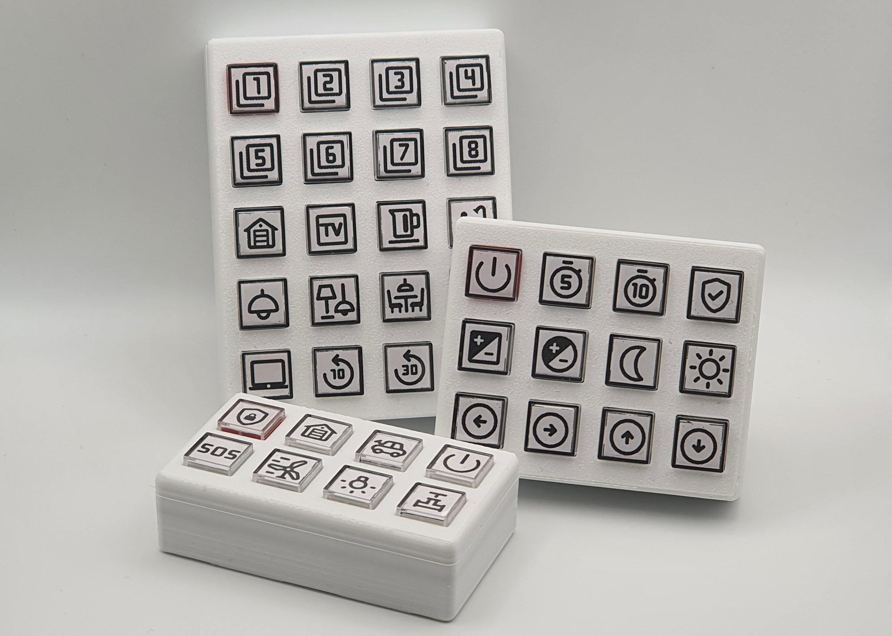
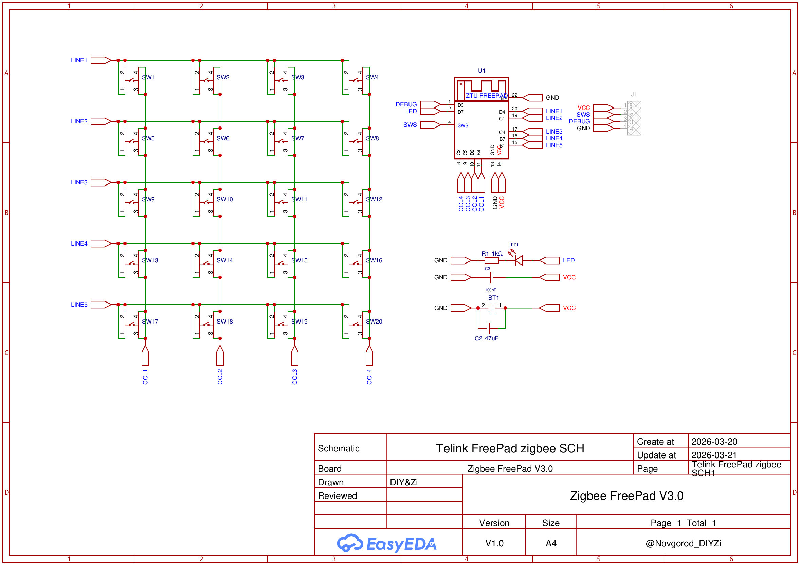
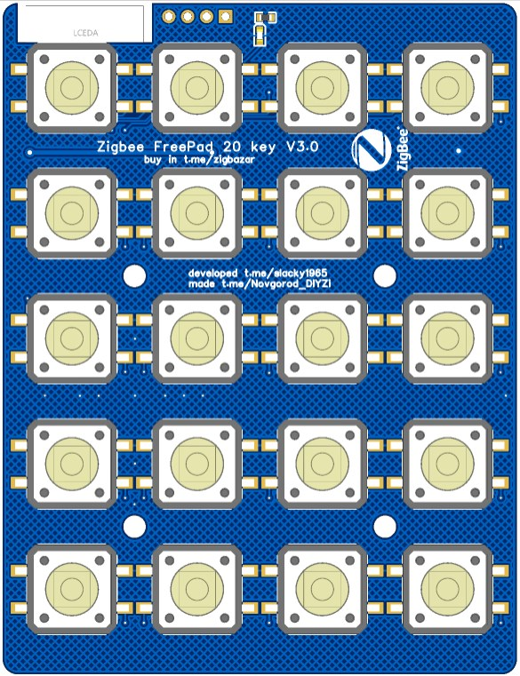
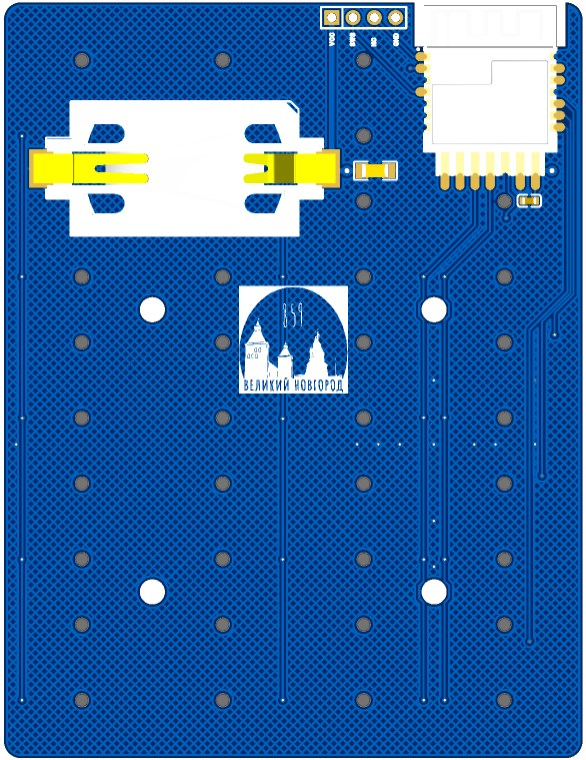
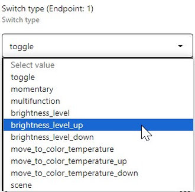
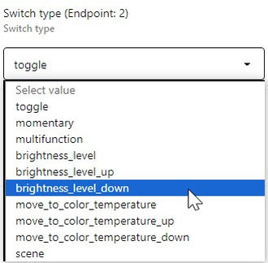
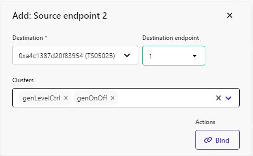
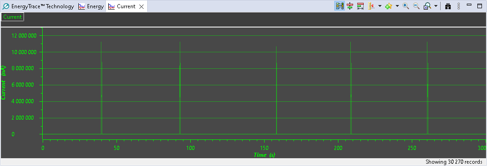
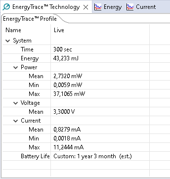

# freepad_tlsr_zed

Remote control with 8/12/20 buttons Zigbee End Device by TLSR8258 (ZTU module)

[](https://github.com/slacky1965/freepad_tlsr_zed)
[](https://github.com/slacky1965/freepad_tlsr_zed/releases)



## Описание

`Freepad` является многофункциональным пультом дистанционного управления устройствами в сети `Zigbee`. `Freepad` является конечным устройством, которое питается от батарейки `CR2450`. `Freepad` может быть реализован с 8, 12 или 20 кнопками. Нумерация кнопок происходит слева направо, сверху вниз. Номер кнопки соответствует номеру `endpoint'а`.

Прототипом этой версии `Freepad'а` был проект на CC2530 - ["Универсальный пульт Zigbee"](https://modkam.ru/2019/07/31/universalnyj-pult-zigbee/)

## Возможности

`Freepad` дает возможность управлять устройствами в сети `Zigbee` напрямую, без использования автоматизаций в УД.

Выбор работы каждой клавиши выбирается отдельно через `Switch type`.

- `toggle` - устанавливает режим работы кнопки для включения и выключения какого-либо устройства. Фиксируются только только одиночные нажатия. Высылаются команды `on`, `off` или `toggle` в зависимости от настроек `Switch actions`. Команды высылаются только при нажатии кнопки.
- `momentary` - устанавливает режим работы кнопки для включения и выключения какого-либо устройства. Фиксируются только одиночные нажатия. Высылаются команды `on`, `off` или `toggle` в зависимости от настроек `Switch actions`. Команды высылаются как при нажатии кнопки, так и при ее отпускании.
- `multifunction` - фиксируются 1 нажатие, 2 нажатия, 3 нажатия, удержание и отпускание кнопки после удержания. Высылаются одноименные `actions` - `"hold"`, `"single"`, `"double"`, `"triple"` и `"release"`.
- `brightness_level` - устанавливает режим работы кнопки для управления яркостью одной кнопкой. Фиксируется одиночное нажатие, удержание и отпускание после удержания.
	- Одно нажатие - высылается команда `toggle` на устройство, для изменения его состояния на противоположное.
	- Удержание - высылается команда `move to level`. Устройство должно плавно увеличивать или уменьшать яркость (направление меняется при каждом последующем нажатии), пока последняя не станет равна значению `level`, который берется из атрибута `minLevel` или `maxLevel`. Скорость увеличения/уменьшения яркости берется из атрибута `onOffTransitionTime`, который можно изменить через dev-консоль. По умолчанию это значение равно 25. Если устройство выключено, то при команде на увеличение яркости устройство включается. При достижении минимального значения яркости устройство не выключается.
	- Отпускание после удержания - высылается команда `level stop`.
- `brightness_level_up` - устанавливает режим работы кнопки для увеличения яркости. Фиксируется одиночные и двойные нажатия, удержание и отпускание после удержания.
	- Одно нажатие - высылается команда `on` на устройство.
	- Двойное нажатие - высылается команда `step level` на устройство (прибавляет к текущему значению яркости примерно 25 единиц). Если устройство выключено, оно включается.
	- Удержание - высылается команда `move to level`. Устройство должно плавно увеличивать яркость, пока последняя не станет максимальной - значение максимальной яркости берется из атрибута `maxLevel`. Увеличение продолжается, пока удерживается кнопка и не достигнуто значение `maxLevel`. Скорость увеличения яркости берется из атрибута `onOffTransitionTime`, который можно изменить через dev-консоль. По умолчанию это значение равно 25. Если устройство было выключено, оно включается.
	- Отпускание после удержания - высылается команда `stop level`.
- `brightness_level_down` - устанавливает режим работы кнопки для уменьшения яркости. Фиксируется одиночные и двойные нажатия, удержание и отпускание после удержания.
	- Одно нажатие - высылается команда `off` на устройство.
	- Двойное нажатие - высылается команда `step level` на устройство (отнимает от текущего значения яркости примерно 25 единиц). Если устройство включено, а яркость достигла минимального предела, оно выключается.
	- Удержание - высылается команда `move to level`. Устройство должно плавно уменьшать яркость, пока последняя не станет минимальной - значение минимальной яркости берется из атрибута `minLevel`. Уменьшение продолжается, пока удерживается кнопка и не достигнуто значение `minLevel`. Скорость уменьшения яркости берется из атрибута `onOffTransitionTime`, который можно изменить через dev-консоль. По умолчанию это значение равно 25. Устройство не выключается если яркость достигла минимального предела.
	- Отпускание после удержания - высылается команда `stop level`.
- `move_to_color_temperature` - устанавливает режим работы кнопки для управления температурой цвета одной кнопкой. Фиксируется удержание и отпускание после удержания.
	- Удержание - высылается команда `move to color temperature`. Устройство должно плавно увеличивать или уменьшать температуру цвета (направление меняется при каждом последующем нажатии).
	- Отпускание после удержания - высылается команда `stop move step`.
- `move_to_color_temperature_up` - устанавливает режим работы кнопки для увеличения температуры цвета. Фиксируется одиночные нажатия, удержание и отпускание после удержания.
	- Одно нажатие - высылается команда `step color temperature` на устройство (прибавляет к текущему значению 87 единиц).
	- Удержание - высылается команда `move to color temperature`. Устройство должно плавно увеличивать температуру цвета. Увеличение продолжается, пока удерживается кнопка.
	- Отпускание после удержания - высылается команда `stop move step`.
- `move_to_color_temperature_down` - устанавливает режим работы кнопки для уменьшения температуры цвета. Фиксируется одиночные нажатия, удержание и отпускание после удержания.
	- Одно нажатие - высылается команда `step color temperature` на устройство (отнимает от текущего значения 87 единиц).
	- Удержание - высылается команда `move to color temperature`. Устройство должно плавно уменьшать температуру цвета. Уменьшение продолжается, пока удерживается кнопка.
	- Отпускание после удержания - высылается команда `stop move step`.
- `scene` - работа со сценами. Сцены создаются в управляемом устройстве во вкладке `Scene` или в группе. При нажатии на кнопку посылается команда `recall scene` на устройство или в группу.

---

## Железо

Принципиальная схема устройства.

<div align="center"> 
<a></a>
</div>

Плата.

<div align="center"> 
<a></a><br>
Вид сверху
</div><br><br>

<div align="center"> 
<a></a><br>
Вид снизу
</div><br><br>

Гербер можно создать самостоятельно вот из этого [проекта](https://oshwlab.com/novgorod73/zigbee-freepad)

Файлы `STL` для печатного корпуса - [case.rar](doc/case/case.rar)

---

## Компиляция из исходников (Windows)

- Установите [Telink IoT Studio](https://doc.telink-semi.cn/tools/telink_iot_studio/TelinkIoTStudio_V2025.2.zip). Откройте `Telink IoT Studio` и создайте пространство `Workspace`, где будут храниться проекты.
- Клонируйте этот репозиторий в `Workspace`, который создали в `Telink IoT Studio`<br>
	```
	git clone https://github.com/slacky1965/freepad_tlsr_zed.git
	```
- Импортируйте проект в `Telink IoT Studio` - `File -> Import -> General -> Existing Projects into Workspace`. В `Select root directory` укажите директорию, куда склонировали проект. Нажмите `Finish`.
- Отредактируйте пути в `makefile` к компилятору (он там, куда установили `Telink IoT Studio`).
- Разверните проект и в `Build Targets` запустите `clean` для проверки. Если отработает без ошибок, значит все сделано правильно.

Проект можно собрать не только из IDE, можно в терминале, находясь в директории проекта, дать команду `make`.

## Как загрузить прошивку

1. Через оригинальный программатор.
2. Через DIY программатор. Как его сделать описано [тут](https://github.com/pvvx/TLSRPGM).
3. Через USB-UART [адаптер](https://github.com/pvvx/ATC_MiThermometer?tab=readme-ov-file#the-usb-com-adapter-writes-the-firmware-in-explorer-web-version).

Прошивка грузится по адресу 0.

---

## Управление `Freepad`

- Для добавления `Freepad` в сеть нукжно 5 раз быстро нажать на любую кнопку, после чего светодиод загорится на 3 секунды. Пока он горит, нужно нажать и удерживать эту же кнопку.
- Для сброса (reset) микроконтроллера `Freepad` нужно просто бысто нажать 10 раз любую кнопку.
- Для принудительной отправки репорта по батарейке нужно просто быстро нажать 4 раза любую кнопку.


## Настройка

Рассмотрим настройку на примере управления яркостью умной лампы.

- Выбрать кнопки, которые будут отвечать за увеличение и уменьшение яркости. Пусть это будут 1 и 2 кнопки.
- Зайти в `z2m` в `Exposes` и назначить для 1 кнопки `brightness_level_up`, а для 2 кнопки `brightness_level_down`.<br>
<div align="center"> 
<a></a>
</div>
- Зайти в `z2m` в `Bind` и для 1 и 2 `endpoint'ов` настроить биндинг на нужную лампу.
<div align="center"> 
<a></a>
</div><br>
Не забываем после нажатия `Bind` в web-интерфейсе нажимать на любую кнопку на `Freepad'е`.

Все готово. 

Теперь при коротком нажатии на 1 кнопку лампа будет включаться. При двойном нажатии на 1 кнопку будет увеличивать яркость на один шаг. При удержании будет повышать яркость, пока удерживается кнопка.

При коротком нажатии на 2 кнопку лампа будет выключаться. При двойном нажатии на 2 кнопку будет уменьшаться яркость на один шаг. При удержании будет уменьшаться яркость, пока удерживается кнопка.

---

## Потребление

Если нажимать кнопку один раз в минуту, то батарейки должно хватить на чуть более 1 года.

<div align="center"> 
<a></a>
</div>

---

Связаться с Олегом, автором  схемы и платы, можно в **[Telegram](https://t.me/Novgorod_DIYZi)**.
Связаться со мной можно в **[Telegram](https://t.me/slacky1965)**.

### Если захотите отблагодарить автора, то это можно сделать через [ЮMoney](https://yoomoney.ru/to/4100118300223495)

---

## История версий
- 1.0.01
	- Начало.

[Наверх](#Top)

